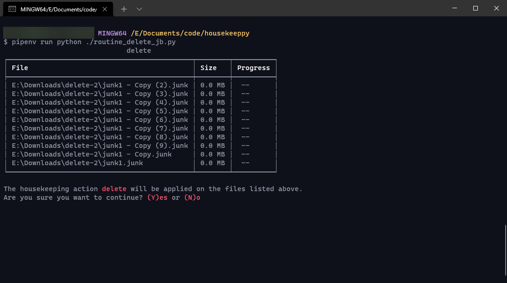

# [WIP] Housekeep

An unnecessarily complicated and over-engineered script I created to automatically delete junk files on my computer. 

**Warning: Early in development, and not tested. Don't run it anywhere near important system directories or you might lose files if anything is misconfigured.**


<p align="center">

</p>

## Features 

- **Specify folder root and optional regex pattern** to selectively target files in your specific folder. 

- **Plugin support** to easily add new types of actions to be performed on the files. Currently **delete** is available.

- **Rich terminal experience** powered by [`rich`](https://github.com/willmcgugan/rich), with GUI support planned in the future. Like plugins, I'll try to make this as plug n' play as possible. 

- **Generates your own routine file** that you can edit anytime.

- **Auto-generates executable scripts** (batch and shell script) that you can then schedule using Task Scheduler on Windows, or cron on linux/macOS. 

## Getting Started

0. You will require the latest version of Python and [`pipenv`](https://github.com/pypa/pipenv)
   installed. 

   Install [Python](https://www.python.org/downloads/), and run `pip install pipenv` to install pipenv.

1. Clone or extract this repository somewhere on your hard drive.

2. To create a new routine, run the `setup.py` script using Python:

    ```shell
    python ./setup.py
    ```

    Once the requirements are installed, setup should automatically begin the "Create new routine" process. 

## Create a new routine

A routine is basically a way to list out files and apply an action like 'delete' on them. 

Housekeep achieves this by generating a Python script that loads the plugin of your choice and selects files within the folder you specified, optionally filtering through regex matching. When this script is run, the files are read and the actions provided by the plugins are applied to these files.

If you followed the Getting Started guide and ran `setup.py`, the create routine script was automatically started for you. You can create a routine anytime by running the `setup.py` script.

1.  Choose the action you want to use for your routine. Currently there's only the "delete" action so press Enter to proceed with this option.

2. Next, you will be prompted to choose the directory you want to run the routine on. Press any key to open the file dialog and choose your directory. 

3. Next, you will be prompted to optionally enter a regex pattern against which files will be matched. If you have a pattern, paste it here, or skip by pressing Enter. (Test your regex before setting it)

4. Next, you will be prompted to optionally give a name to your routine file. If you skip, name will be auto-generated.

5. Your routine script, and a executable shell script for launching the routine file will be generated. Follow the instructions displayed for your operating system, or refer online resources to properly schedule this task. 

## Extensions 

**Note: This stuff isn't tested yet**

To create your own actions to apply on the files, create your own plugin class (Start by duplicating `housekeep/plugins/sample.py` or follow this guide):

1. In the `housekeep/plugins` folder within the project directory, create a new Python file.

2. Create a new class in your newly created file. **The class and the file its in should have the same name, otherwise your plugin will not be detected.** 

3. Make sure you implement the following attributes in your class:

    - `self.name` - A string holding the name of the plugin (same name as file name)
    - `self.description` - A string giving a short description of what action it will perform. 
    - `run_action(self, files, on_file_success, on_file_failure, **kargs)`
        - `files` is a list of absolute file paths that the action must be applied to.
        - `on_file_success(f)` is a function that acts as callback on successful handling of a file. It accepts 1 param: f - the current file that got successfully handled.
        - `on_file_failure(f,e)` similarly is a callback, but on failure. Make sure you pass e - the exception that occurred. 
        - Additional parameters can be accepted using **kargs but support for this isn't there yet. 


> This was created mostly as a fun project for killing time and to automate a boring task. While there might be updates to this project in the future, currently there is no plan of providing support or making it a public package. 

